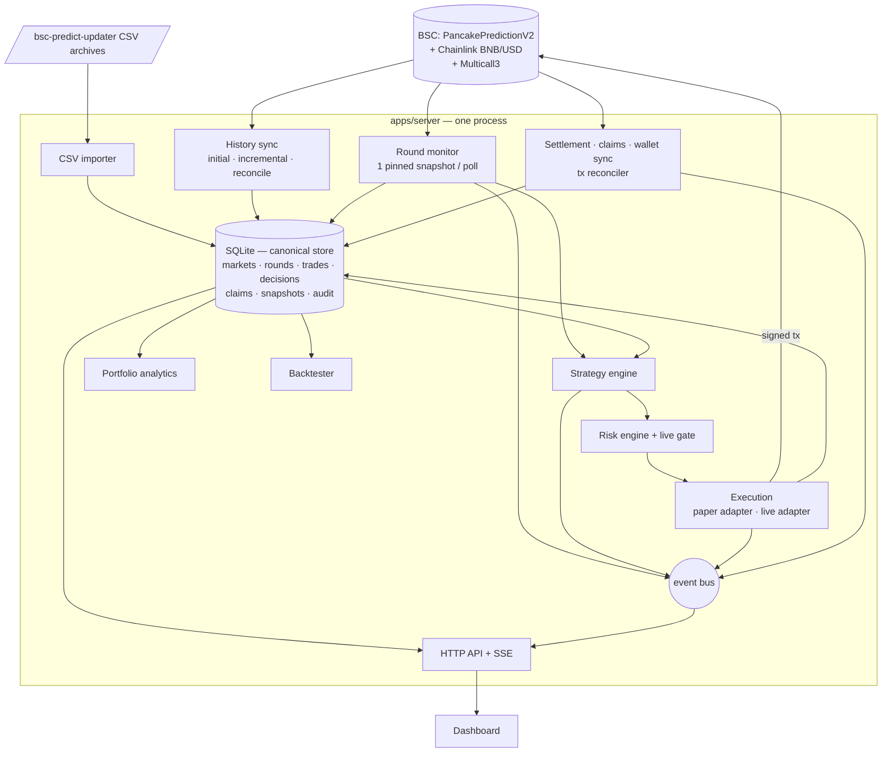

# Architecture

## Shape: a modular monolith

```
unified-bsc-predict/
├── packages/core/            pure domain logic (no I/O), shared by server and web
│   └── src/  units · round (status, outcome, payout math) · trade (state machine, P&L) · risk · portfolio ·
│             backtest · strategy/{types, params, config, context, pipeline, builtins}
├── apps/server/              one Node process: HTTP API + SSE + background worker + CLI
│   └── src/  config · logger · db/{database, migrations} · repositories/* · chain/{types, viem, abis} ·
│             services/* · api/{server, routes, auth} · app.ts (composition root) · main.ts · cli.ts
├── apps/web/                 Vite + React operator dashboard (built into apps/web/dist, served by the server)
├── docs/  docker/  scripts/  .github/workflows/
```

**Why one TypeScript codebase.** The Python bot was ~300 lines and duplicated the round model that the TS
frontend also had; the updater was ~150 lines of Python writing CSV. Keeping two runtimes would mean two copies
of the round/payout logic. Everything is now TypeScript: the core payout, risk and strategy code is written once
and used by the server (live/paper), the backtester and the dashboard.

**Why one process.** Ingestion, strategy evaluation, execution and settlement must share one view of round state
and one transaction boundary. A single process with an in-process event bus and SQLite (WAL) gives that without
distributed-state problems. The bot's desired state lives in the database, so the CLI can control a running server.

**Why SQLite.** A single-writer trading bot is SQLite's ideal workload: ACID transactions, unique constraints,
triggers, zero operational overhead, a single file to back up. Money is stored as decimal-string wei, so nothing
depends on 64-bit integer limits. (Moving to PostgreSQL would only require reimplementing `db/database.ts` and the
DDL; repositories use portable SQL.)

## Data flow



Rounds are only ever written to the `rounds` table. The monitor publishes the latest snapshot but holds no
separate round state; the strategy engine, settlement and the dashboard read from the same rows.

## The decision pipeline (identical in BACKTEST, PAPER and LIVE)

```
buildContext(visible data at time t)  →  plugin.evaluate(ctx)  →  Signal
   → direction filter → computeStake(sizing) → evaluateRisk(limits, state, gates) → Decision
   → execution adapter:  BACKTEST: simulated fill   PAPER: recorded fill   LIVE: chain transaction
```

`packages/core/src/strategy/pipeline.ts` implements everything up to the Decision. Strategy exceptions, invalid
signals and invalid configs become recorded `NO_TRADE` decisions — never trades. Every final decision (bet or no
bet) is stored with its inputs, indicators and the result of every risk check.

## Round model and finality

Status is derived from chain data and **chain time** (`core/round.ts`), mirroring the V2 contract:

| Status                    | Condition                                                                                                           |
| ------------------------- | ------------------------------------------------------------------------------------------------------------------- |
| UPCOMING / OPEN / LOCKING | not locked; before start / before lock / after lock                                                                 |
| LIVE / CLOSING            | locked; before close / after close, not yet ended                                                                   |
| **ENDED** (final)         | `oracleCalled`                                                                                                      |
| **CANCELLED** (final)     | not ended and `chainTime > closeTimestamp + bufferSeconds` (the contract can no longer end it; bets are refundable) |

Final data is read at `head − CONFIRMATIONS` (re-pinned every 20 s during long syncs, because public nodes prune
state after ~128 blocks). A trigger forbids changing a final round, except replacing CSV-imported data with
authoritative chain data; the old values are kept in `round_corrections`.

Outcome: close > lock → BULL, close < lock → BEAR, equal → TIE (the treasury takes the pool: a loss for everyone),
cancelled → refund. Payout = `amount × rewardAmount / rewardBaseCalAmount` (integer), exactly as `claim()`.
Paper/backtest payouts add the simulated stake to the recorded pool so its own dilution is modelled.

## Trade lifecycle

```
PENDING → SUBMITTING → SUBMITTED → CONFIRMED → SETTLED
   └──────────┴────────────┴──→ FAILED
```

- Paper and imported trades go `PENDING → CONFIRMED`.
- LIVE: the transaction is signed locally and its hash is written (`SUBMITTING`) **before** broadcast. An error that
  may have reached the mempool leaves the trade `SUBMITTING`; the reconciler later resolves it from the receipt or
  the contract `ledger(epoch, wallet)` — it never re-creates a transaction.
- Every transition is guarded (`UPDATE … WHERE status = :from`) and appended to `trade_events` (append-only trigger).
- `result` (WON / LOST / REFUNDED) and `claim_status` (NOT_APPLICABLE / UNCLAIMED / CLAIMING / CLAIMED) are separate.
- A unique partial index enforces one non-failed live bet per wallet and round, as the contract does.

## Bot lifecycle

`STOPPED ⇄ RUNNING ⇄ PAUSED`, any → `EMERGENCY_STOPPED` → (explicit reset) → `STOPPED`. The in-memory phase is
`RECOVERING` until startup recovery finishes; trading requires `RUNNING` **and** `READY`.

Startup recovery: contract params → pending transactions → incremental history sync (+ non-final rounds) → wallet
trades → settlements → portfolio snapshot → READY. Live arming is cleared unless `BOT_AUTO_RESUME_LIVE=true`.

## Database schema (migration 1)

| Table                                        | Purpose                                                                                                        | Integrity                                                   |
| -------------------------------------------- | -------------------------------------------------------------------------------------------------------------- | ----------------------------------------------------------- |
| `markets`                                    | contracts (V2 tradable; V1 and PRDT historical) + parameters read from chain                                   | UNIQUE(slug), UNIQUE(chain_id, contract)                    |
| `rounds`                                     | canonical round store (prices 8-dec INTEGER, amounts TEXT wei, status/outcome/is_final, source)                | UNIQUE(market_id, epoch); final-immutability trigger        |
| `rounds_v`                                   | view adding `start_price` = previous round's lock price (same `executeRound` tx)                               |                                                             |
| `round_corrections`                          | archived values replaced by chain data                                                                         |                                                             |
| `wallets`                                    | signer / watch-only addresses (never keys), `getUserRounds` cursor                                             | UNIQUE(address)                                             |
| `strategies`                                 | plugin instance, JSON config, enabled / paper / live flags                                                     | UNIQUE(slug)                                                |
| `strategy_decisions`                         | every final decision with signal, reason, risk checks, inputs                                                  | UNIQUE(strategy_id, round_id, mode)                         |
| `trades`                                     | the ledger: execution, gas, settlement, P&L, claim status                                                      | UNIQUE(uid), UNIQUE(tx_hash), one live bet per wallet+round |
| `trade_events`                               | status history                                                                                                 | append-only triggers                                        |
| `claims`                                     | claim transactions                                                                                             | UNIQUE(tx_hash)                                             |
| `portfolio_snapshots`                        | periodic balance / P&L / drawdown per mode                                                                     |                                                             |
| `bot_state`                                  | single row: status, live armed, failure counter                                                                | CHECK(id = 1)                                               |
| `audit_events`                               | immutable-style audit trail                                                                                    | append-only triggers                                        |
| `backtest_runs`, `sync_state`, `import_runs` | jobs and ingestion bookkeeping; backtest runs heartbeat (migration 2) so only dead runs are marked interrupted |                                                             |

## Real-time

`GET /api/stream` (SSE) pushes `market` snapshots every poll, plus `bot`, `trade`, `decision`, `audit`, `backtest`
and `portfolio` events. The dashboard extrapolates chain time locally between snapshots for countdowns and refetches
lists when relevant events arrive — it never polls the chain.

## RPC budget

One market poll = 2 RPC calls (a Multicall3 snapshot at head, then the three active rounds pinned to the same block).
At the default 3 s interval that is ~40 calls/minute. History sync fetches 200 rounds per Multicall.
Live pre-flight checks (balance, gas price, ledger, head) happen only when a live bet is about to be placed.
